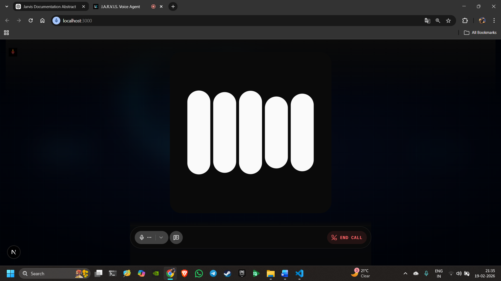
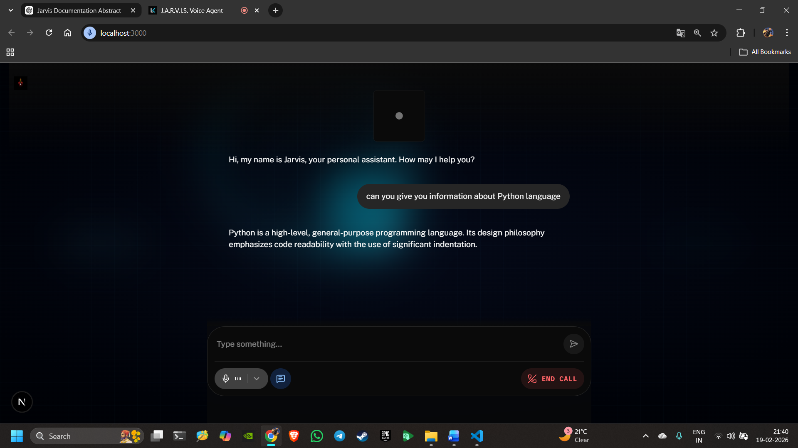

# 🤖 J.A.R.V.I.S AI Voice Assistant

> 🚀 Real-time AI assistant with automation, memory, and system control


---

## 🎯 Overview

J.A.R.V.I.S (Just A Rather Very Intelligent System) is a **real-time AI-powered voice assistant** that combines **Conversational AI + System Automation**.

It allows users to interact using voice commands and perform tasks like:

* Opening applications
* Searching the web
* Controlling system settings
* Managing media playback
* Storing and recalling memory

Built using **LiveKit + Google Realtime AI**, this project demonstrates practical implementation of modern AI systems.

---

## 🚀 Features

* 🎤 Real-time voice interaction
* 🧠 AI-powered responses (Google Realtime Model)
* ⚙️ System automation (open apps, WiFi, brightness, etc.)
* 🌐 Google search with voice summary
* 🖼️ Image search support
* 🧾 Memory storage & recall
* 🔊 Voice response output
* 🌍 LiveKit-based web UI

---

## 🧠 What Makes This Project Special

* ⚡ Real-time streaming using LiveKit
* 🤖 AI + Automation combined in one system
* 🎵 Smart media control:
  * YouTube (Play, Pause, Next, Previous)
  * VLC Media Player
  * System media (Spotify, etc.)
* 🧾 Memory system for personalized interaction
* 🌐 Full-stack architecture (Python + Node.js frontend)

---

## 🏗️ System Architecture

User → LiveKit UI → Assistant Core → AI Model → Tool Modules → Operating System

---

## 🛠️ Technologies Used

* Python
* LiveKit (Realtime Communication)
* Google Realtime AI (Gemini)
* Node.js
* WebRTC
* JavaScript

---

## 📸 Demo

### 🖥️ Home Screen
<p align="center">
  
</p>


### 🎤 Voice Interaction


### 🎤 Text Interaction


Examples:

* UI running in browser
* Voice interaction
* Terminal output

---

## ⚙️ Installation & Setup

### 1️⃣ Clone Repository

git clone https://github.com/daredevil0005/J.A.R.V.I.S-v1.0.git
cd J.A.R.V.I.S-v1.0

---

### 2️⃣ Backend Setup (Python)

py -m venv .venv
.\.venv\Scripts\Activate.ps1
python -m pip install -r requirements.txt

---

### 3️⃣ Environment Variables

Create `.env` file in root folder:

GOOGLE_API_KEY=your_api_key
GOOGLE_SEARCH_API_KEY=your_search_key
SEARCH_ENGINE_ID=your_engine_id
LIVEKIT_URL=your_livekit_url
LIVEKIT_API_KEY=your_livekit_key
LIVEKIT_API_SECRET=your_livekit_secret

---

### 4️⃣ Run Backend

python agent.py console

---

### 5️⃣ Frontend Setup

cd agent-ui
npm install
npm run dev

---

### 6️⃣ Open Application

http://localhost:3000

---

## ⚠️ Important Notes

* Run backend and frontend in **separate terminals**
* Ensure `.env` file is properly configured
* Internet connection is required
* Microphone permission must be enabled

---

## 🧠 How It Works

1. User gives voice command
2. LiveKit captures and streams audio
3. AI processes input
4. Assistant decides:
   * Response → AI reply
   * Action → Tool execution
5. System performs action
6. Jarvis responds via voice

---

## ⚙️ Feature Workflow Example

### Example: “Open Chrome”

* 🎤 Input → Voice command
* 🧠 Processing → Intent detection
* ⚙️ Execution → Tool function call
* ✅ Output → Chrome opens + voice confirmation

---

## 🧾 Memory System

Jarvis can store and recall user data.

Example:

* “Remember my name is Pratik”
* “What is my name?”

✔ Stored in memory module
✔ Retrieved dynamically

---

## 🔍 Google Search Feature

* Uses search API
* Opens browser automatically
* Provides voice summary

---

## 🖼️ Image Search

* Opens Google Images
* Displays visual results

---

## 🧩 Project Structure

```
J.A.R.V.I.S/
│
├── agent.py
├── features/
├── memory/
├── agent-ui/
├── requirements.txt
└── .env
```

---

## 🔐 Security

* API keys stored in `.env`
* No hardcoded secrets
* Controlled system access via tools

---

## 🧪 Testing

Tested for:

* Voice input/output
* AI response generation
* System commands
* Memory storage
* Performance

---

## 🚀 Future Scope

* Wake word detection (“Hey Jarvis”)
* Cloud deployment
* Mobile app
* Multi-user support
* Smart home integration

---

## 👨‍💻 Author

**Pratik S. Dabhane**

---

## 🎯 Conclusion

J.A.R.V.I.S demonstrates **real-time AI interaction + automation + system control** in a single integrated system.

It showcases how modern AI technologies can be applied to build intelligent, interactive applications.

---

⭐ If you like this project, consider giving it a star!
